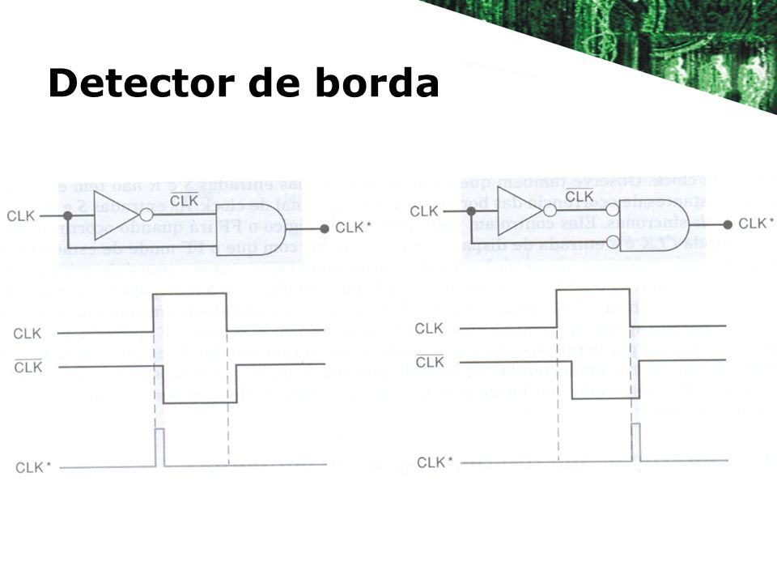

# **Aula(10/04) - Detector de Borda**

## **🧠 Por que flip-flops são sensíveis à borda?**

Nos flip-flops, **não importa o nível lógico** do clock por si só.

O que realmente interessa é **a transição** — ou seja, **quando o clock muda de estado**.

### **🔍 Detector de borda:**

Para detectar esse momento exato, utiliza-se um **detector de borda**, que **gera um pulso rápido** apenas no instante da mudança do clock.

### **Exemplo:**

- Se o flip-flop for **sensível à borda de subida**, ele só “acorda” e processa as entradas no instante em que o clock sobe de 0 para 1.

### **🔍Entendendo visualmente…**

---

## **✅ Vantagens da detecção por borda:**

- **Sincronia total** em sistemas digitais
- **Evita alterações indesejadas** durante todo o nível alto ou baixo
- Permite que o circuito **funcione como um sistema de memória confiável**

---

O **Flip-Flop** é, em essência, um **Latch com controle por borda de clock**.

Ele só altera seu estado **quando o clock muda** — tornando-se o componente ideal para **sistemas sequenciais**, **registradores**, **contadores** e muito mais.

A diferença principal entre **latch** e **flip-flop** está em **como e quando eles mudam de estado**.
